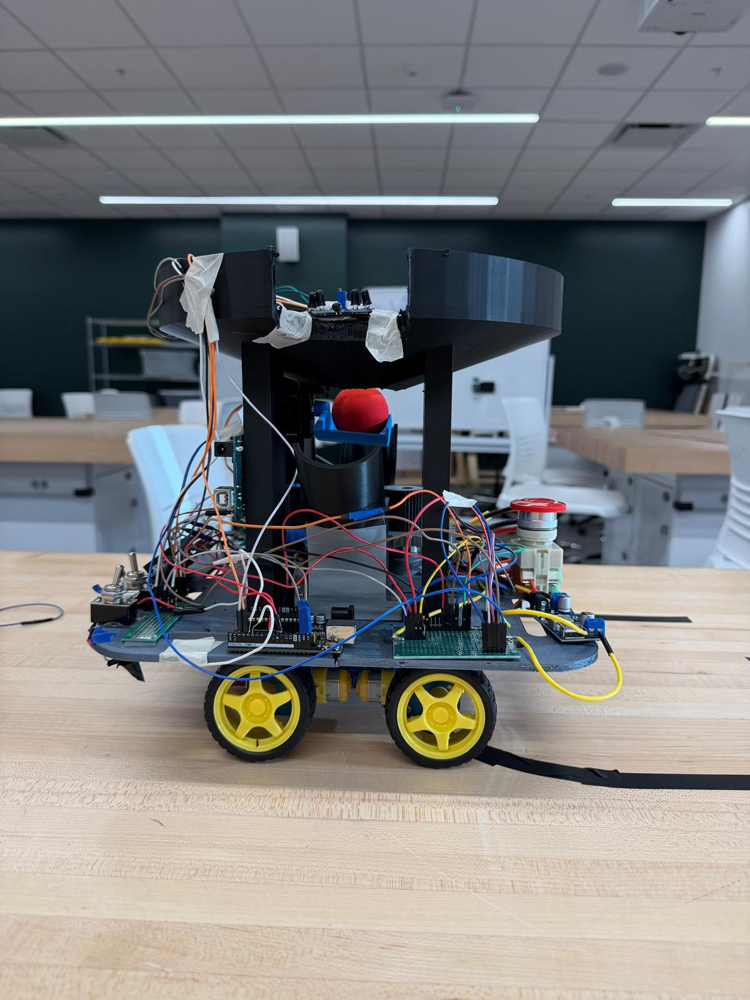
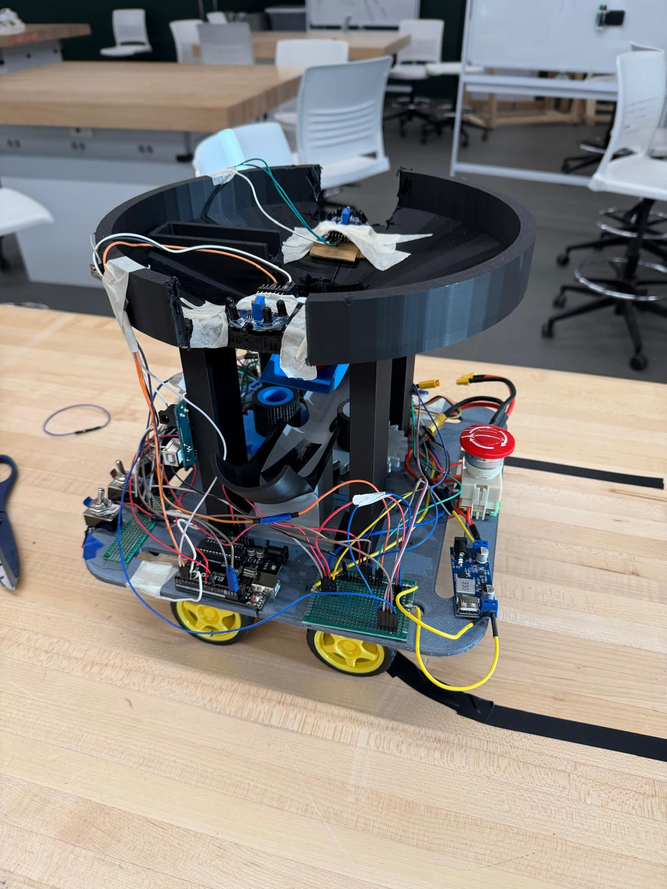
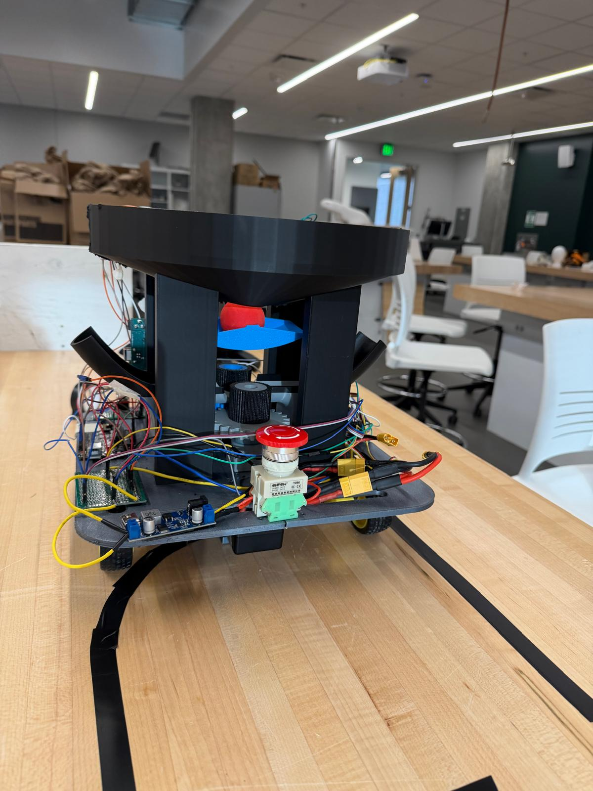

# Autonomous Ball-Launching Robot — STORM Competition

**ME 588 Mechatronics | Purdue University | Spring 2026**

An autonomous ground robot that follows IR-guided tape paths, classifies opponent-controlled targets via IR beacon frequency detection, and launches foam balls using a BLDC flywheel — all within a 2:30 match window from a single button press.

---

## Overview

The STORM (Send Teams Orbs to Remain Monarchs) competition places two robots on a 4 ft x 8 ft field. Each robot starts at HOME BASE, follows taped paths to four HILLs (raised buckets 12 inches above the surface), reads IR beacons to determine opponent allegiance (750 Hz = Blue, 1500 Hz = Red), and launches foam balls to flip control. Most HILLs at time expiry wins.

Team 12 (**TREBUCHET**) achieved full autonomous operation across multiple complete 2:30 runs: correct navigation to all four junctions, accurate IR classification, and consistent ball delivery into opponent buckets.

| Side | Top | Front |
|:---:|:---:|:---:|
|  |  |  |

---

## System Architecture

```
                 +-----------------+
                 |   Arduino 1     |  IR sensing, game timer, LCD, serial TX
  IR Sensor 1 --| D2 (interrupt)  |
  IR Sensor 2 --| D3 (interrupt)  |
  Start Toggle--| D4              |
  Team Toggle --| D5              |
      LCD I2C --| A4/A5           |
                 |   D11 (TX) ----+------> D10 (RX)  |
                 +-----------------+                   |
                                                       v
                 +-----------------+
                 |   Arduino 2     |  Motion, FSM, launcher
  SparkFun Arr--| A4/A5 (I2C)    |
  PCA9685 0x40--| A4/A5 (I2C)    |--> L298N --> 4x DC Motors
  PCA9685 0x41--| A4/A5 (I2C)    |--> ESC  --> BLDC + Flap Servo
                 +-----------------+
```

I2C addresses: `0x3E` line array, `0x40` drive PCA9685 (1000 Hz), `0x41` shooter PCA9685 (50 Hz), `0x27` LCD (Arduino 1).

---

## Hardware

| Component | Part |
|---|---|
| Microcontrollers | 2x Arduino Uno |
| Drive motors | 4x DC geared motors, L298N H-bridge |
| PWM expander (drive) | PCA9685 @ 0x40, 1000 Hz |
| PWM expander (launcher) | PCA9685 @ 0x41, 50 Hz |
| Line sensor | SparkFun 8-sensor IR reflectance array @ 0x3E |
| IR beacon sensors | 2x flame sensor modules (left + right) |
| Launcher motor | QWinOut A2212 1000KV brushless motor |
| ESC | 30A SimonK ESC (bidirectional) |
| Power | 12V battery, LM2596 buck converter (5V logic rail) |
| Display | 16x2 multicolor LCD @ 0x27 |
| Chassis | Dual-layer prefabricated steel plates |

**CAD and 3D-printed files** (in `hardware/`):

| File | Description |
|---|---|
| `Spur Gear 24 teeth drive.step` | Driver gear on BLDC shaft |
| `Spur Gear 24 teeth driven.step` | Driven gear coupled to flywheel base |
| `Driven_base.step` | Flywheel base hub |
| `TPU_sleeve.step` | TPU friction sleeve on flywheel |
| `launcher_ramp.step` | Curved ball exit ramp (direction per team) |
| `Hopper_part 1.STL` / `Hopper_part 2.STL` | Conical ball hopper (black PLA) |
| `ball_holder_flap.STL` | Servo-actuated gate flap (blue material) |
| `Body1_wdisplay.stl` / `Body2_wdisplay.stl` | LCD mounting bracket |
| `Body3_forcam.stl` / `Body4_forcam.stl` | Chassis body panels |
| `battery_chassis_attachment.STL` | Battery bracket |
| `Final_Project_KiCAD.pdf` | Full circuit schematic |
| `Final_E-Connections.docx` | Electrical connections reference |

> Replication requires the full mechanical assembly. Firmware alone is not sufficient without the matching physical hardware.

---

## Firmware

### Arduino 1 — Sensing and Game Logic
`firmware/Arduino_1/Arduino_1.ino`

- Interrupt-driven pulse counting on D2/D3; samples every 250 ms and classifies frequency as Self, Opponent, or No Signal
- Frequency windows: 600-900 Hz (750 Hz Blue beacon), 1300-1700 Hz (1500 Hz Red beacon)
- Runs 2:30 countdown timer, updates LCD every 200 ms
- Sends `TEAM:*` and `TARGET:*` messages to Arduino 2 every 500 ms and immediately on any change

### Arduino 2 — Motion and Launcher Control
`firmware/Arduino_2/Arduino_2.ino`

- 9-state FSM: IDLE, ESC_ARMING, GRACE, HOME_BYPASS, LINE_FOLLOW, JCT_DRIVE, IR_VOTE, LAUNCH, STOPPED
- PD line following with weighted-average position from 8-sensor array
- 5-second vote window at each junction; fires only if `votesOpponent > votesSelf AND votesOpponent >= 3`
- 8-phase non-blocking launch sequence: direction settle, spinup, flap open, flap return, ESC off, resume boost
- Global STOP override honored within one loop iteration from any state

### Serial Protocol (Arduino 1 -> Arduino 2, 9600 baud)

| Message | Meaning |
|---|---|
| `START` / `STOP` | Begin run / kill all |
| `TEAM:RED` / `TEAM:BLUE` | Set team color |
| `TARGET:OPPONENT` | Opponent HILL detected — vote to fire |
| `TARGET:SELF` | Own HILL detected — vote to skip |
| `TARGET:NONE` | No signal — abstain |

---

## Key Design Decisions

**Dual PCA9685** — Drive motors need 1000 Hz PWM; the ESC and flap servo need 50 Hz. A single board switching frequencies caused ESC direction glitches. Dedicated boards per domain fixed this completely.

**ESC neutral arming** — The bidirectional ESC latches direction from the signal wire during its 3-second arming window. Arming at the team angle (0 or 180 degrees) locked out the opposite direction. Arming always at 90 degrees neutral, then switching post-arm, made team color changes reliable.

**Vote-based launch gating** — A single IR classification is unreliable at range. Accumulating votes over 5 seconds and requiring both a majority and minimum count of 3 opponent votes filters transient noise without meaningfully delaying the decision.

**Dual-Arduino split** — IR frequency measurement uses hardware interrupts with tight 250 ms windows. Sharing a board with I2C traffic to two PCA9685s degraded classification accuracy. Splitting onto separate Arduinos with SoftwareSerial isolated the two timing domains.

---

## Calibration Parameters

| Parameter | Value |
|---|---|
| KP / KD / KI | 0.35 / 0.40 / 0.00 |
| BASE / CURVE / PIVOT speed | 1100 / 1500 / 3000 PWM |
| Junction sensor threshold | 5 sensors active |
| Junction cooldown | 800 ms |
| Vote window | 5000 ms |
| Min opponent votes to fire | 3 |
| ESC launch throttle | 0.27 (27%) |
| Flywheel spinup | 1500 ms |
| Flap hold / return | 600 ms / 600 ms |
| Flap angle Blue / Red / Center | 15 / 165 / 90 degrees |
| ESC direction Blue / Red | 0 / 180 degrees |
| ESC arming reference angle | 90 degrees |
| IR window 750 Hz | 600-900 Hz |
| IR window 1500 Hz | 1300-1700 Hz |

---

## Dependencies

**Arduino 1:** `Wire.h`, `SoftwareSerial.h` (built-in), `LiquidCrystal_I2C`

**Arduino 2:** `Wire.h`, `SoftwareSerial.h` (built-in), `Adafruit_PWMServoDriver`, `sensorbar.h`

- Adafruit PWM Servo Driver: https://github.com/adafruit/Adafruit-PWM-Servo-Driver-Library
- SparkFun Line Follower Array: https://github.com/sparkfun/SparkFun_Line_Follower_Array_Arduino_Library

---

## Repository Structure

```
storm-autonomous-robot/
├── README.md
├── firmware/
│   ├── Arduino_1/Arduino_1.ino
│   └── Arduino_2/Arduino_2.ino
├── hardware/
│   ├── Spur Gear 24 teeth drive.step
│   ├── Spur Gear 24 teeth driven.step
│   ├── Driven_base.step
│   ├── TPU_sleeve.step
│   ├── launcher_ramp.step
│   ├── Hopper_part 1.STL
│   ├── Hopper_part 2.STL
│   ├── ball_holder_flap.STL
│   ├── Body1_wdisplay.stl
│   ├── Body2_wdisplay.stl
│   ├── Body3_forcam.stl
│   ├── Body4_forcam.stl
│   ├── battery_chassis_attachment.STL
│   ├── Final_Project_KiCAD.pdf
│   └── Final_E-Connections.docx
├── docs/
│   └── ME588_Team12_FinalReport.pdf
└── images/
    ├── storm-front.jpeg
    ├── storm-side.jpeg
    └── storm-top.jpeg
```

---

## Team

| Name |
|---|---|
| Ashish Kale |
| Sukesh Ranganathan | 
| Manu Vazhunnavar | 
| Pritam Ghoshal | 
| Jaemin Cho | 

**Course:** ME 588 Mechatronics, Prof. Laura Blumenschein | Purdue University | Spring 2026
